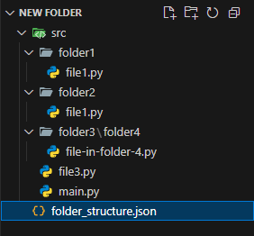

# StructGen

StructGen is a lightweight VS Code extension that helps you **generate complex folder structures** from a simple JSON input. It's great for scaffolding domain-driven folder architectures in seconds.

## Version

- **Current Version**: v1.0.0

### Requirements

- **VS Code**: Latest stable version recommended

### For contributing:
- **Node.js**: v22.14.0^
- **npm**: v10.9.2^

## Installation

### Method 1: Automatic Installation
To install **StructGen** for use as a Visual Studio Code extension, you can follow these simple steps:

### 1. Install the extension using a single command

Open your terminal and run the following command to download and install the extension:

For **Windows** (PowerShell):

```powershell
powershell -Command "curl.exe -L 'https://github.com/FragsterDev/StructGen/releases/download/StructGen/structgen-1.0.0.vsix' -o $env:TEMP\structgen.vsix; code --install-extension $env:TEMP\structgen.vsix; rm $env:TEMP\structgen.vsix"
```

For **Windows** (CMD):
```cmd
curl -L "https://github.com/FragsterDev/StructGen/releases/download/StructGen/structgen-1.0.0.vsix" -o "%TEMP%\structgen.vsix" && code --install-extension "%TEMP%\structgen.vsix" && del "%TEMP%\structgen.vsix"
```

For **macOS/Linux** (Bash terminal):
```bash
curl -L https://github.com/FragsterDev/StructGen/releases/download/StructGen/structgen-1.0.0.vsix -o /tmp/structgen.vsix && code --install-extension /tmp/structgen.vsix && rm /tmp/structgen.vsix
```

This will download the `.vsix` file and install the extension automatically in Visual Studio Code.

### Method 2: Manual Installation (if automatic install fails)

### Step 1: Download the VSIX File
Download the extension package using one of these methods:

1. **From GitHub Releases**:
   - Visit the [StructGen Releases page](https://github.com/FragsterDev/StructGen/releases)
   - Download `structgen-1.0.0.vsix` from the "Assets" section

2. **Direct Download** (recommended):  
   ▶️ [Download structgen-1.0.0.vsix now](https://github.com/FragsterDev/StructGen/releases/download/StructGen/structgen-1.0.0.vsix)  
   *(Right-click → "Save Link As" if needed)*

### Step 2: Install via VS Code Command
Open a terminal (where you have downloaded the release file) and run:

```bash
code --install-extension path/to/structgen-1.0.0.vsix
```

### Installation Path Examples

### Windows
```cmd
code --install-extension "%USERPROFILE%\Downloads\structgen-1.0.0.vsix"
```

### macOS/Linux Installation

```bash
code --install-extension "$HOME/Downloads/structgen-1.0.0.vsix"
```

### 2. Verify Installation

Once the installation is complete, you can verify that the extension is installed by checking the Extensions view in Visual Studio Code (`Ctrl+Shift+X`) and searching for StructGen.

## Features

- Generate nested folders and files instantly from a single JSON file.
- Supports nested object structure and arrays of files.
- Perfect for backend architecture, monorepos, or boilerplate setups.

---

## How to Use

1. Open VS Code in any workspace.
2. Press `Cmd+Shift+P (macOS)` or `Ctrl+Shift+P (Windows/Linux)` to open the Command Palette.
3. Search and run: `Generate Folder Structure`.
4. First, select the target directory where you want to create the folder structure.
5. Then, select your `JSON file` describing the structure.
6. The folder structure will be `generated` in your `selected directory!`

The extension will process your JSON structure and create folders and files accordingly:

1. Keys `without` file extensions become `folders`
2. Keys `with` file extensions become `files` with the `specified content`
3. See the example below to learn more.

---

## Example Input
```json
{
  "src": {
    "folder1": {
      "file1.py": "#file content" 
    },
    "folder2": {
      "file1.py": "#file content" 
    },
    "file3.py": "#file content",
    "folder3": {
      "folder4": {
        "file-in-folder-4.py": "# content in folder 4"
      }
    },
    "main.py": "# content in main"
  }
}
```

## Output




## Collaboration Instructions

To contribute to **StructGen** or collaborate with others, follow these steps:

### 1. Clone the Repository

Clone the project repository by running the following command in your terminal:

```bash
git clone https://github.com/your-username/structgen.git
```

### 2. Install Dependencies

Navigate to the project directory and install the necessary npm packages:

```bash
cd structgen
npm install
```

### 3. Run the Extension Locally

You can test the extension locally within VS Code:

1. Open the project folder in **Visual Studio Code**.
2. Press `F5` to start the extension in a new VS Code window (**Extension Development Host**).
3. In the new window, open any folder and run the `Generate Folder Structure` command from the **Command Palette** to test the functionality.


## License 

### Distributed under MIT License. See `LICENSE.md` for more information.